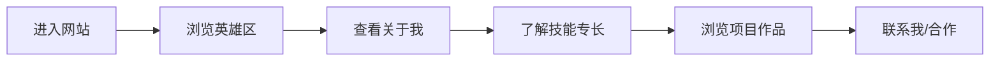

## 1. 产品概述

个人作品集网站，展示个人信息、技能、项目作品和联系方式，打造专业且富有个性的在线名片。

- **主要用途**：个人品牌展示、作品呈现、求职/合作联系
- **目标用户**：招聘方、潜在合作伙伴、访客
- **产品价值**：以独特设计风格展现个人特色，留下深刻第一印象

## 2. 核心功能

### 2.1 功能模块

1. **首页英雄区**：个人介绍、头像/视觉焦点、社交链接
2. **关于我**：个人简介、背景故事、兴趣爱好
3. **技能展示**：技术栈、专业能力、技能等级可视化
4. **项目作品**：作品集卡片、项目详情、技术标签
5. **联系方式**：联系表单、社交媒体、邮箱

### 2.2 页面详情

| 页面名称 | 模块名称 | 功能描述 |
|-----------|-------------|---------------------|
| 首页 | 导航栏 | 固定顶部导航，滚动时样式变化，平滑滚动锚点跳转 |
| 首页 | 英雄区 | 大标题名字、职位标语、个人头像、CTA按钮、社交图标、打字机效果 |
| 首页 | 关于我 | 个人照片、简介文字、关键数据统计（工作年限/项目数等） |
| 首页 | 技能展示 | 技能分类标签、技能进度条动画、技能图标 |
| 首页 | 项目作品 | 项目卡片网格、悬停动效、项目筛选、技术标签 |
| 首页 | 联系方式 | 联系表单（姓名/邮箱/消息）、联系信息卡片、社交媒体链接 |
| 首页 | 页脚 | 版权信息、快速导航、回到顶部按钮 |

## 3. 核心流程

用户访问网站 → 浏览英雄区吸引注意力 → 向下滚动了解个人信息 → 查看技能和项目作品 → 感兴趣则通过联系方式取得联系

## 4. 用户界面设计

### 4.1 设计风格

- **整体风格**：极简主义 × 温暖质感 — 克制而有温度的设计语言
- **主色调**：深炭灰 `#1a1a1a`（背景）、奶油白 `#f5f0e8`（文字）
- **强调色**：琥珀金 `#d4a574`、赤陶橙 `#c17f59`
- **辅助色**：鼠尾草绿 `#7d8f7a`、雾霾蓝 `#6b7a8f`
- **按钮风格**：圆角胶囊形，悬浮时微微上浮并有光晕效果
- **字体**：
  - 标题：**Playfair Display**（优雅衬线体，彰显品质感）
  - 正文：**DM Sans**（现代无衬线，清晰易读）
- **布局风格**：大留白、不对称构图、卡片式项目展示
- **图标风格**：线性简约图标，配合微妙的填充变化

### 4.2 页面设计概览

| 页面名称 | 模块名称 | UI元素 |
|-----------|-------------|-------------|
| 首页 | 导航栏 | 半透明毛玻璃效果、滚动变色、当前位置高亮 |
| 首页 | 英雄区 | 大标题文字渐显动画、打字机效果标语、圆形头像带光晕、社交图标悬停放大 |
| 首页 | 关于我 | 图文左右分栏、数据统计数字滚动动画、柔和阴影卡片 |
| 首页 | 技能展示 | 技能标签云、进度条从左到右动画填充、分类切换 |
| 首页 | 项目作品 | 卡片网格布局、悬停时图片放大+信息上滑、技术标签徽章 |
| 首页 | 联系方式 | 玻璃态表单、输入框聚焦发光、提交按钮动效 |
| 首页 | 页脚 | 极简版权行、快速链接、回到顶部圆形按钮 |

### 4.3 响应式设计

- **设计策略**：桌面端优先，移动端自适应
- **断点**：1200px（桌面）、768px（平板）、480px（手机）
- **移动端优化**：
  - 汉堡菜单导航
  - 单列布局
  - 触控友好的按钮尺寸（≥44px）
  - 字体大小自适应调整
  - 简化动画效果保证流畅度

### 4.4 动效与交互

- **页面入场**：元素渐次淡入上滑（staggered reveal）
- **滚动触发**：技能条动画、数字计数动画在进入视口时触发
- **悬停效果**：按钮上浮+阴影加深、卡片3D倾斜、链接下划线扩展
- **微交互**：表单输入框聚焦时标签上浮、导航链接下划线跟随
- **背景氛围**：微妙的噪点纹理叠加、渐变光斑装饰
