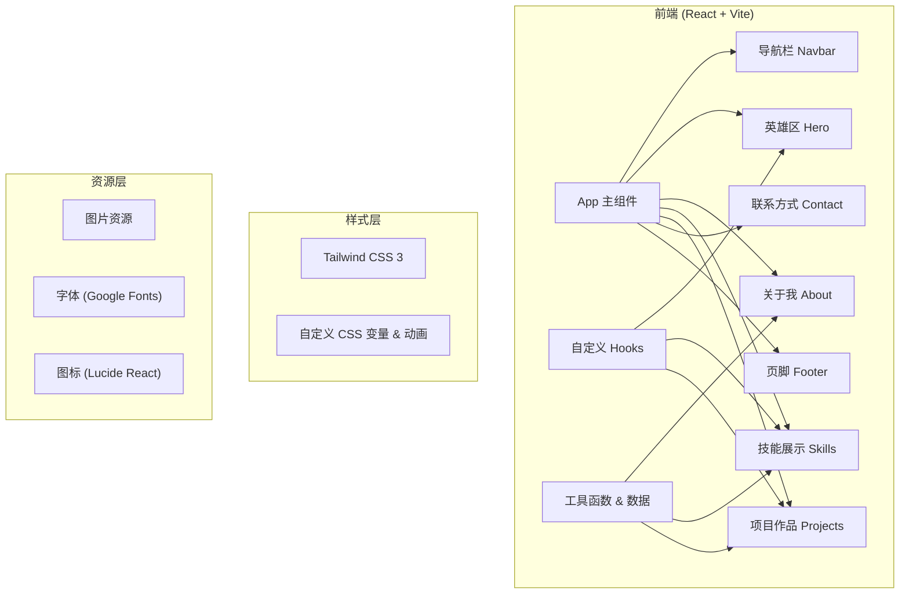

## 1. 架构设计



## 2. 技术描述

- **前端框架**：React@18 + TypeScript
- **构建工具**：Vite@5
- **样式方案**：Tailwind CSS@3 + 自定义 CSS
- **图标库**：Lucide React
- **字体**：Google Fonts (Playfair Display + DM Sans)
- **动画**：CSS Animations + Transitions + Framer Motion（可选，轻量场景用CSS）
- **后端**：无（纯前端静态网站）
- **数据库**：无（数据使用 mock 硬编码）
- **部署**：静态文件部署

## 3. 目录结构

```
src/
├── components/
│   ├── Navbar.tsx        # 导航栏
│   ├── Hero.tsx          # 英雄区
│   ├── About.tsx         # 关于我
│   ├── Skills.tsx        # 技能展示
│   ├── Projects.tsx      # 项目作品
│   ├── Contact.tsx       # 联系方式
│   └── Footer.tsx        # 页脚
├── hooks/
│   ├── useScrollAnimation.ts  # 滚动动画hook
│   └── useTypewriter.ts       # 打字机效果hook
├── data/
│   ├── projects.ts       # 项目数据
│   └── skills.ts         # 技能数据
├── App.tsx               # 主应用组件
├── main.tsx              # 入口文件
└── index.css             # 全局样式 & Tailwind
```

## 4. 路由定义

| 路由 | 用途 |
|-------|---------|
| / | 首页（单页应用，全部内容在一个页面，通过锚点导航） |

说明：个人作品集采用单页滚动形式，所有内容在同一页面内通过锚点平滑滚动切换。

## 5. 数据模型

### 5.1 项目数据

```typescript
interface Project {
  id: number;
  title: string;
  description: string;
  image: string;
  tags: string[];
  category: 'web' | 'app' | 'design';
  link?: string;
  github?: string;
}
```

### 5.2 技能数据

```typescript
interface Skill {
  name: string;
  level: number; // 0-100
  category: 'frontend' | 'backend' | 'design' | 'tools';
  icon?: string;
}
```

## 6. 关键技术实现点

1. **滚动动画**：使用 Intersection Observer API 实现元素进入视口时的触发动画
2. **平滑滚动**：使用 CSS `scroll-behavior: smooth` + 锚点跳转
3. **响应式设计**：Tailwind 断点 + 移动端适配
4. **性能优化**：
   - 图片懒加载
   - 组件按需渲染
   - CSS 动画优先（GPU 加速）
5. **可访问性**：语义化 HTML、键盘导航、ARIA 标签
